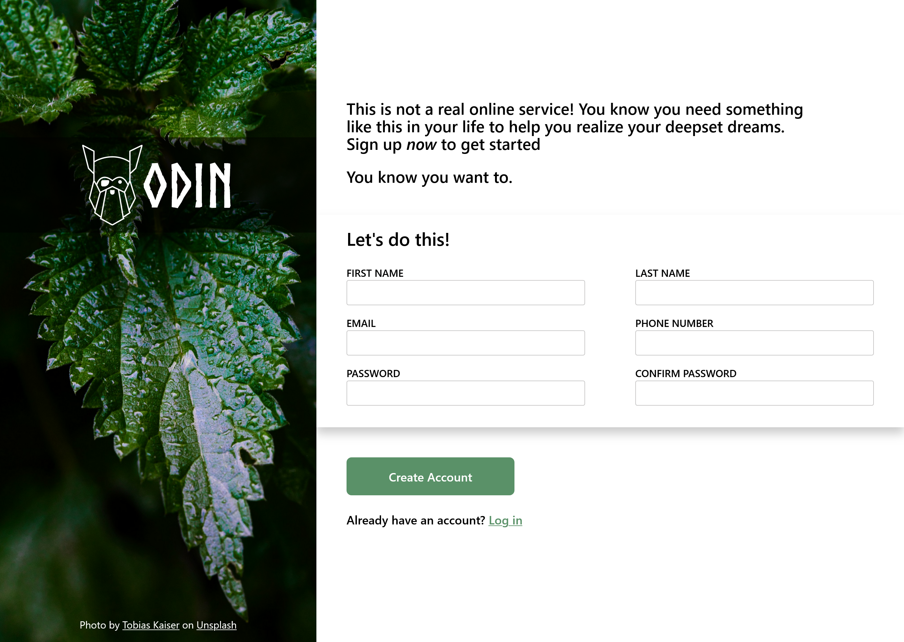

# Sign Up Page

## Overview

This project is a simple sign-up page for a web application, created as part of [The Odin Project](https://www.theodinproject.com/) curriculum. The page includes form validation and user input handling using a class-based approach.

## Screenshot

## Features

- Input validation for various field types (e.g., email, password)
- User-friendly error messages

## Technologies Used

- HTML5
- CSS3 (including Flexbox/Grid for layout)
- JavaScript (ES6+)
- Webpack for module bundling
- ESLint for linting JavaScript code
- Prettier for code formatting

## Live Preview

You can view a live preview of the sign-up page here: [Live Demo](https://yasenyanev.github.io/sign-up-form/)

## Getting Started

To get started with this project, follow these steps:

1. **Clone the repository:**

   git clone https://github.com/YasenYanev/sign-up-form.git
   cd sign-up-page
   npm install
